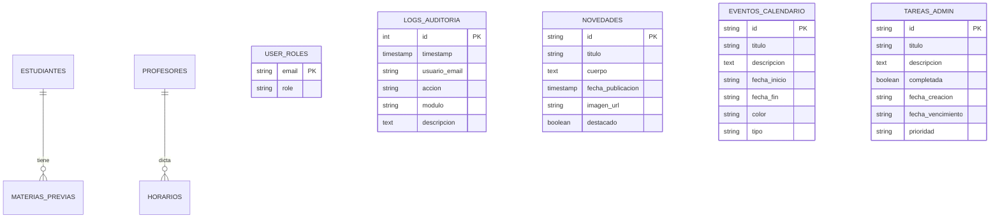

# Sistema Institucional — CEIJA Anexo Alberdi
## Documentación Técnica y de Arquitectura

Este documento contiene la explicación técnica y de arquitectura del **Sistema Institucional** (anteriormente conocido como SisGest), diseñado para la administración escolar, control de legajos físicos, seguimiento de materias previas y gestión horaria del CEIJA N° 12 Anexo Alberdi.

---

## 1. Descripción General del Sistema

El **Sistema Institucional** es una plataforma web desarrollada en **React** y empaquetada con **Vite**. Su propósito principal es digitalizar y optimizar la administración escolar de la institución, ofreciendo dos vistas principales:
1. **Portal Público:** Permite a los estudiantes y la comunidad en general consultar de manera segura el estado de su legajo y materias previas ingresando únicamente su DNI, además de consultar los horarios del ciclo lectivo actual, la cartelera de novedades institucionales y el calendario escolar.
2. **Panel de Gestión (Administrativo):** Exclusivo para directivos (rol `admin`) y personal docente (rol `comun`), permitiendo realizar operaciones CRUD (Crear, Leer, Actualizar, Borrar) sobre legajos de estudiantes, fichas de profesores, horarios semanales, carteleras de novedades, calendario de eventos y tareas administrativas.

---

## 2. Módulos y Secciones del Sistema

El panel de gestión está dividido en los siguientes módulos:

* **Estudiantes (`StudentModule.jsx`):** 
  * Permite registrar y editar los datos de los estudiantes (DNI, nombres, datos de contacto, última escuela, etc.).
  * Registra de forma precisa el estado de entrega de la documentación física en papel (DNI, C.U.S., Certificado Primaria, Pase Provisorio, Pase Definitivo).
  * Evalúa de forma automática si un estudiante está **"APTO TITULAR"** (cumpliendo con la regla: DNI + CUS + [Certificado Primaria o Pase Definitivo]).
  * Administra un listado de materias previas y equivalencias pendientes de aprobación para cada alumno.
* **Profesores (`TeacherModule.jsx`):** 
  * Gestiona las fichas de profesores (datos personales, designación titular/interino/suplente, estado activo/licencia/baja, y folios físicos de archivo).
  * Controla la entrega de documentación obligatoria anual (título habilitante, régimen de incompatibilidad horaria, constancia de servicios y declaración de antecedentes de delitos sexuales).
  * Mantiene registro de las materias y los años asignados a cada profesor.
* **Horarios (`ScheduleModule.jsx`):**
  * Presenta una grilla interactiva semanal (Lunes a Viernes de 18:50 a 22:30 hs) para cada año de cursado (1°, 2° y 3°).
  * Permite asignar materias y docentes en bloques de 30 o 50 minutos.
* **Cartelera (`NewsModule.jsx`):**
  * Canal de comunicación institucional para publicar avisos importantes en el portal público. Admite destacar publicaciones y cargar imágenes.
* **Calendario Escolar (`CalendarModule.jsx`):**
  * Agenda visual para organizar y destacar feriados, jornadas pedagógicas, mesas de examen y eventos institucionales.
* **Lista de Tareas (`TodoModule.jsx`):**
  * Gestor de pendientes estilo Kanban/Checklist para la organización diaria de la dirección.
* **Configuración (`ConfigModule.jsx`):**
  * Panel exclusivo para administradores. Permite realizar el sembrado inicial de datos consolidados y dar de alta nuevas cuentas asignándoles el rol correspondiente.
  * Muestra el módulo de **Logs de Auditoría**, que registra en tiempo real quién realizó cada cambio, en qué módulo, a qué hora y cuál fue la descripción de la acción.

---

## 3. Arquitectura del Proveedor de Base de Datos (Database Provider Pattern)

Para cumplir con el requisito de migrar a una base de datos relacional y al mismo tiempo mantener el sistema funcional desde Firebase, se implementó un **patrón de diseño Provider** en la capa de datos (`src/db/`):

```
src/
└── db/
    ├── index.js              # Facade / Selector dinámico de proveedor
    ├── localMockProvider.js  # Lógica local utilizando LocalStorage (modo demo)
    ├── firebaseProvider.js   # Lógica conectada a Firebase (Firestore y Auth)
    └── supabaseProvider.js   # Lógica conectada a Supabase (PostgreSQL relacional)
```

La variable de entorno `VITE_DB_PROVIDER` (ubicada en el archivo `.env`) determina qué proveedor se inicializa al arrancar la aplicación:
* `supabase`: Utiliza la base de datos relacional PostgreSQL de Supabase.
* `firebase`: Utiliza la base de datos NoSQL Cloud Firestore de Firebase.
* `mock`: Corre localmente en el navegador sin servicios en la nube (útil para pruebas y desarrollo).

---

## 4. Diseño del Modelo Relacional (Supabase / PostgreSQL)

En la migración relacional, los datos se estructuran siguiendo restricciones de clave externa e integridad referencial (verificado e inicializado en [schema.sql](file:///e:/Pruebas%20Antigravity/SisGest-%20CEIJA%20Alberdi/schema.sql)):



### Relaciones clave:
1. **`materias_previas` ➔ `estudiantes`**: Relación 1-a-muchos vinculada mediante la columna `estudiante_dni` (con restricción `ON DELETE CASCADE` para eliminar las previas automáticamente si se da de baja al alumno).
2. **`horarios` ➔ `profesores`**: Relación 1-a-muchos vinculada mediante la columna `profesor_dni` (con restricción `ON DELETE SET NULL` para no borrar el horario si un docente es dado de baja).

---

## 5. Preparativos para Producción y Seguridad

Se realizaron múltiples optimizaciones para garantizar que el sistema cumpla con estándares de producción:

1. **Gestión Segura de Credenciales:** Todas las claves de Firebase y Supabase se extrajeron de la base de código y se configuraron en un archivo local [.env](file:///e:/Pruebas%20Antigravity/SisGest-%20CEIJA%20Alberdi/.env).
2. **Protección Git:** Se configuró [.gitignore](file:///e:/Pruebas%20Antigravity/SisGest-%20CEIJA%20Alberdi/.gitignore) para omitir cualquier archivo de configuración `.env` en los commits.
3. **Resolución del Bug de Roles:** Durante el inicio de sesión, si el perfil no está mapeado por UID, el sistema realiza una consulta por correo electrónico en la tabla `user_roles` y asocia el nuevo UID para agilizar accesos futuros. Esto soluciona el error donde usuarios creados por el administrador quedaban con el rol por defecto.
4. **Instancia Secundaria para Altas:** Al crear usuarios en el proveedor de Firebase, se utiliza una instancia de inicialización secundaria para registrar las credenciales del nuevo docente en Firebase Auth sin cerrar la sesión administrativa activa del directivo.

---

## 6. Tecnologías Utilizadas

* **React 19:** Biblioteca principal para la construcción de la interfaz reactiva.
* **Vite 8:** Herramienta de construcción y servidor de desarrollo ágil.
* **Supabase Client (`@supabase/supabase-js`):** Integración con PostgreSQL, base de datos y autenticación relacional.
* **Firebase SDK (`firebase/app`, `firebase/auth`, `firebase/firestore`):** Integración con Cloud Firestore y Firebase Auth.
* **Lucide React:** Set de iconos estilizados y modernos para la interfaz.
* **SheetJS (`xlsx`):** Motor de procesamiento y generación de planillas Excel (.xlsx) directamente en el cliente.
