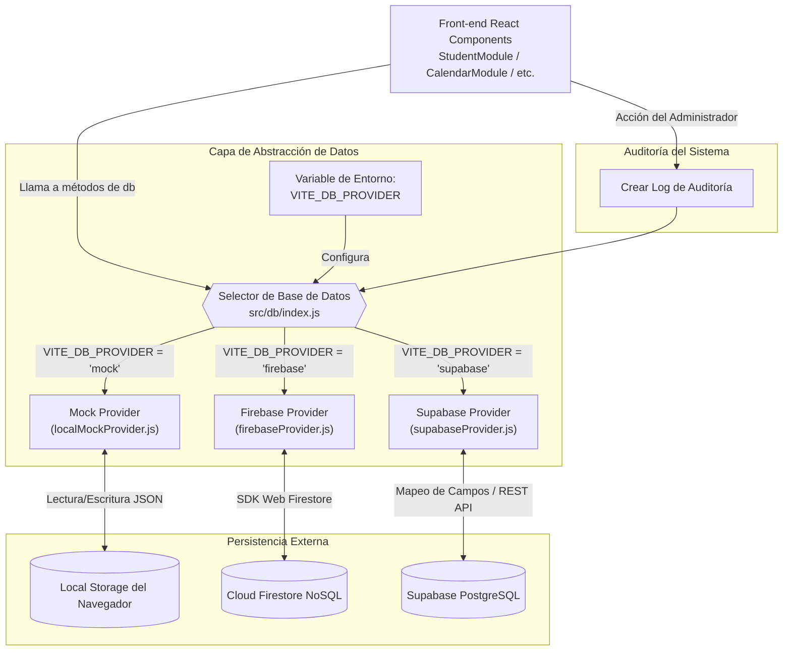
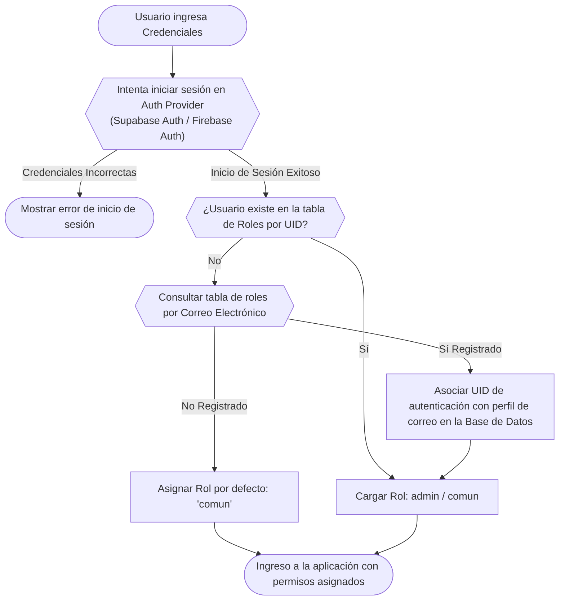

# Diagramas de Bases de Datos y Flujos de Datos — SisGest

Este documento detalla gráficamente el modelado de datos de **SisGest**, incluyendo la estructura de base de datos relacional (Supabase), base de datos documental (Firebase), y los flujos lógicos que gobiernan el sistema.

---

## 1. Modelo de Entidad-Relación (Supabase / PostgreSQL)

A continuación se detalla la estructura física de la base de datos relacional PostgreSQL en Supabase. Este modelo garantiza integridad referencial mediante claves foráneas y cascadas automáticas en bajas.

```mermaid
erDiagram
    ESTUDIANTES {
        varchar dni PK "DNI del estudiante"
        varchar nombre "Nombres"
        varchar apellido "Apellidos"
        varchar ano_actual "Año actual (1°, 2°, 3°)"
        varchar division "División (A, B, C)"
        varchar turno "Turno (Vespertino)"
        varchar estado "Estado (Activo, Inactivo, Egresado)"
        varchar ano_ingreso "Año de ingreso escolar"
        varchar ultima_escuela "Escuela de origen"
        varchar telefono "Teléfono del estudiante"
        varchar email "Correo de contacto"
        varchar tutor_nombre "Nombre del tutor legal"
        varchar tutor_telefono "Teléfono del tutor"
        boolean en_gestion "Bandera de gestión administrativa"
        boolean apto_titular "Habilitación automática de legajo"
        jsonb documentos "Estado de entrega física de documentos"
    }

    MATERIAS_PREVIAS {
        int id PK "Autoincremental"
        varchar estudiante_dni FK "DNI del estudiante (ON DELETE CASCADE)"
        varchar materia "Nombre de la asignatura"
        varchar tipo "Tipo (Previa / Equivalencia)"
        varchar estado "Estado (Pendiente / Aprobada)"
        varchar fecha_examen "Fecha estimada o de aprobación"
    }

    PROFESORES {
        varchar dni PK "DNI del docente"
        varchar nombre "Nombres"
        varchar apellido "Apellidos"
        varchar telefono "Teléfono de contacto"
        varchar email "Correo electrónico"
        varchar designacion "Titular, Interino, Suplente"
        varchar estado "Activo, Licencia, Baja"
        varchar materias_asignadas "Materias en texto separado por comas"
        varchar anos_dicta "Años asignados en texto"
        varchar area "Área (Exactas, Sociales, Lengua, etc.)"
        varchar folio_archivo "Ubicación del legajo físico"
        jsonb documentos "Control de documentación obligatoria anual"
    }

    HORARIOS {
        varchar id PK "Año_División_Turno (e.g. 1_a_vespertino)"
        varchar ano "Año correspondiente (1°, 2°, 3°)"
        varchar division "División"
        varchar turno "Turno"
        jsonb grilla "Matriz estructurada de días y horarios"
    }

    USER_ROLES {
        varchar email PK "Correo de cuenta de usuario"
        varchar role "Rol asignado (admin / comun)"
    }

    LOGS_AUDITORIA {
        serial id PK "Autoincremental"
        timestamp timestamp "Fecha y hora del cambio"
        varchar usuario_email "Usuario autor de la acción"
        varchar accion "Tipo (CREAR, EDITAR, ELIMINAR, MIGRACIÓN)"
        varchar modulo "Módulo afectado"
        text descripcion "Detalle de los cambios realizados"
    }

    NOVEDADES {
        varchar id PK "UUID autogenerado (news_...)"
        varchar titulo "Título de la noticia"
        text cuerpo "Contenido de la novedad"
        varchar fecha_publicacion "Fecha en formato ISO"
        varchar imagen_url "URL de imagen cargada"
        boolean destacado "Mostrar en banner de inicio"
    }

    EVENTOS_CALENDARIO {
        varchar id PK "UUID autogenerado (evt_...)"
        varchar titulo "Título del evento"
        text descripcion "Detalle del evento"
        varchar fecha_inicio "startDate de la UI"
        varchar fecha_fin "endDate de la UI"
        varchar color "Identificador de color visual"
        varchar tipo "Categoría (INSTITUCIONAL, EXAMEN, FERIADO, etc.)"
    }

    TAREAS_ADMIN {
        varchar id PK "UUID autogenerado (tsk_...)"
        varchar titulo "Título o descripción corta de tarea"
        text descripcion "Aclaración sobre el pendiente"
        boolean completada "Estado de resolución"
        varchar fecha_creacion "Fecha de alta"
        varchar fecha_vencimiento "fecha_limite del Front-end"
        varchar prioridad "Prioridad (Alta, Media, Baja)"
    }

    ESTUDIANTES ||--o{ MATERIAS_PREVIAS : tiene
```



---

## 2. Esquema Documental (Firebase / Cloud Firestore)

En el caso de utilizar Firebase como proveedor de persistencia (`VITE_DB_PROVIDER=firebase`), el motor NoSQL organiza los datos en colecciones independientes con formato JSON flexible sin claves foráneas rígidas:

```
Colecciones de Firestore (NoSQL):
├── estudiantes/
│   └── [dni_alumno] { (Documento)
│         dni: String, nombre: String, ..., 
│         documentos: { dni: String, cus: String, ... },
│         previas: [ { materia: String, estado: String, ... } ]
│       }
├── profesores/
│   └── [dni_profesor] { (Documento)
│         dni: String, nombre: String, ..., 
│         documentos: { titulo: String, incompatibilidad: String, ... }
│       }
├── horarios/
│   └── [ano_division_turno] { (Documento)
│         ano: String, division: String, turno: String,
│         grilla: { lunes: [...], martes: [...], ... }
│       }
├── users/
│   └── [uid_usuario] { (Documento)
│         email: String,
│         role: String
│       }
├── logs_auditoria/
│   └── [doc_id] {
│         timestamp: String, usuario_email: String,
│         accion: String, modulo: String, descripcion: String
│       }
├── novedades/
│   └── [news_id] { ... }
├── eventos_calendario/
│   └── [evt_id] { ... }
└── tareas_admin/
    └── [tsk_id] { ... }
```

*Nota: A diferencia de Supabase, en Firebase las "materias previas" no forman una colección aislada con referencias externas, sino que se almacenan directamente en un array embebido dentro del documento de cada estudiante (`estudiantes.previas`), lo que simplifica las lecturas en una sola petición.*

---

## 3. Diagrama de Flujo de Datos (Arquitectura del Sistema)

Este diagrama describe cómo viajan los datos desde la interfaz de usuario de SisGest hasta los respectivos proveedores externos, destacando el rol del patrón Provider.



---

## 4. Diagrama de Flujo del Proceso de Autenticación y Gestión de Roles

Flujo detallado de inicio de sesión de usuario y la resolución para la asignación correcta del Rol (`admin` o `comun`), que incluye la asociación automática de credenciales creada para corregir el bug de consistencia de IDs en altas del administrador:


